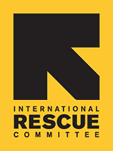

.. CTS documentation master file, created by
   sphinx-quickstart on Fri May 15 16:15:54 2015.
   You can adapt this file completely to your liking, but it should at least
   contain the root `toctree` directive.

Welcome to CTS's documentation!
===============================

The `International Rescue Committee (IRC)`_ has built a remote verification and
monitoring system in order to track and report on the movement of goods to
ensure that the intended beneficiaries receive them. Due to staffing and lack
of access in some of the places we work, the monitoring system makes use of
creative remote monitoring methods (such as mobile data collection, QR coding
and GPS mapping) that integrates with a web application for administration,
management and reporting on the status of shipments. This system is known as
the **Commodity Tracking System (CTS)**.

This is CTS's user and developer documentation. To explore other open source
IRC projects, please see IRC's `GitHub`_ account.

.. _International Rescue Committee (IRC): http://www.rescue.org/
.. _GitHub: https://github.com/theirc

Contents:

.. toctree::
   :maxdepth: 1

   user/index
   developer/index
   release_notes

Indices and tables
==================

* :ref:`genindex`
* :ref:`modindex`
* :ref:`search`

